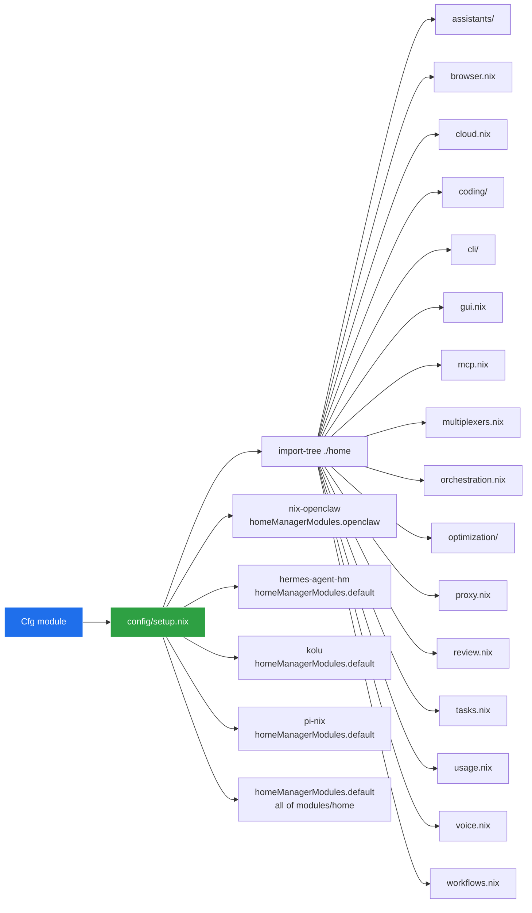
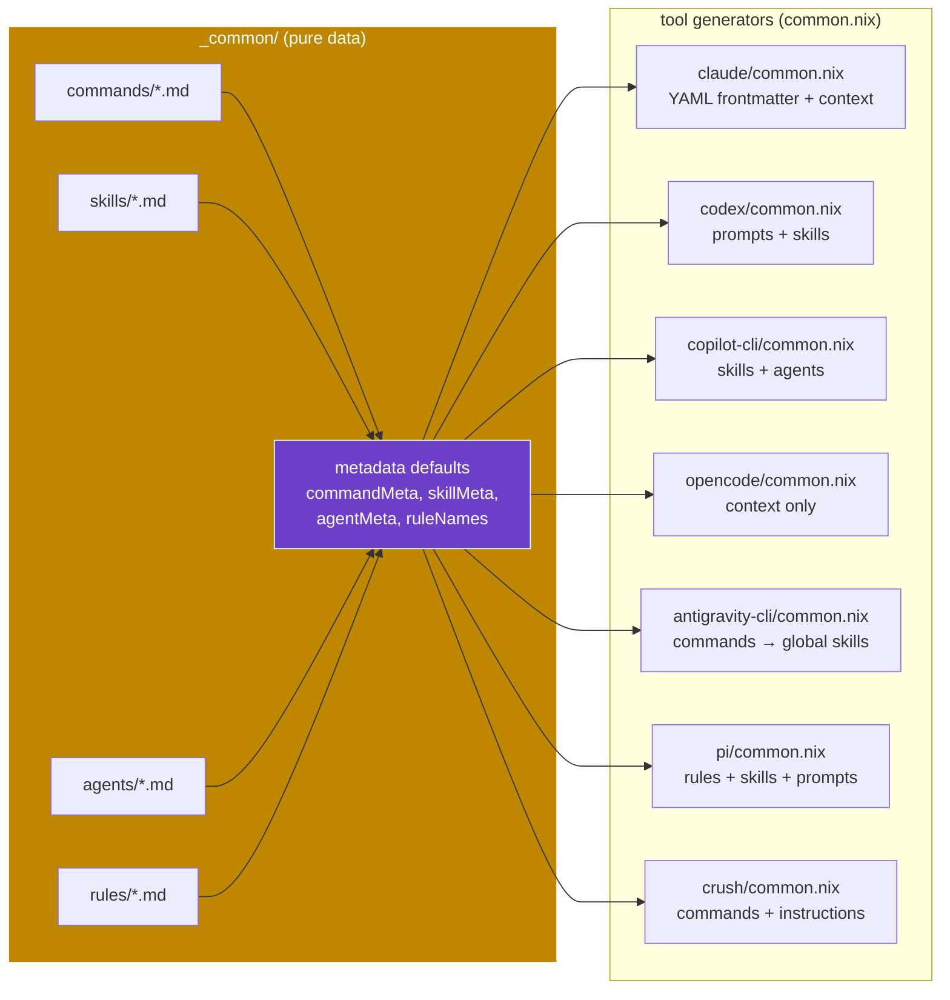
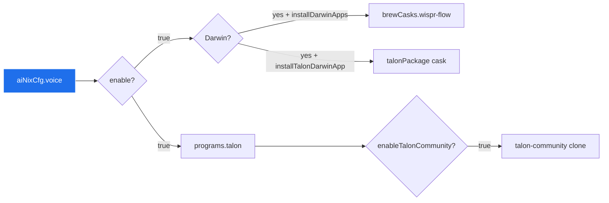
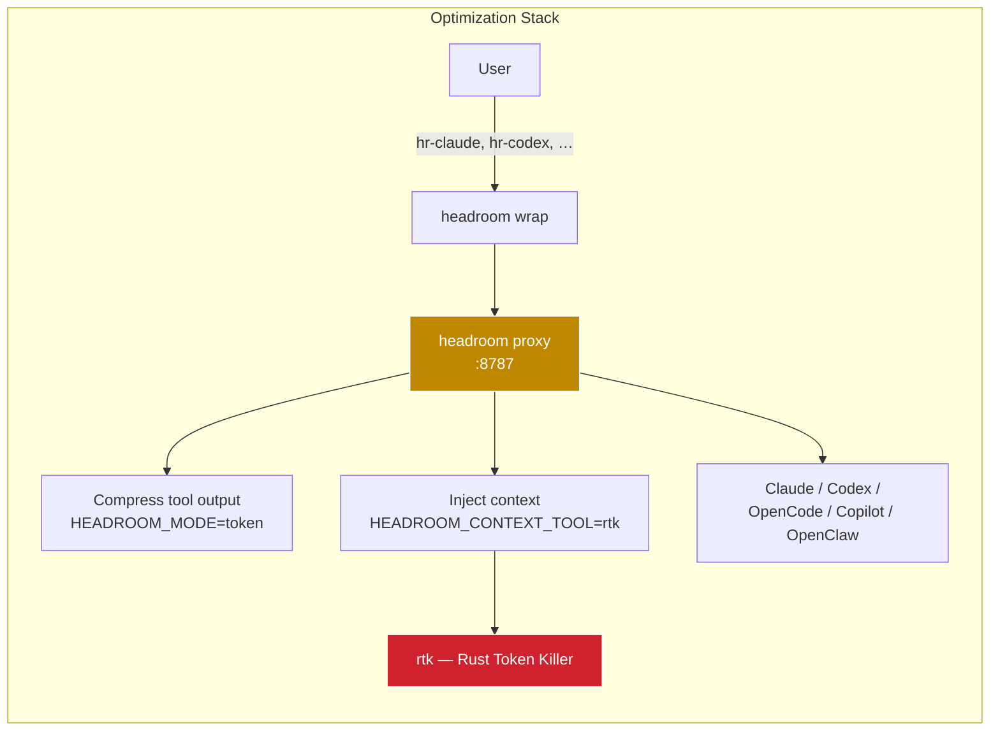
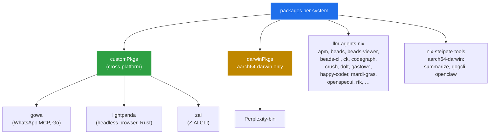
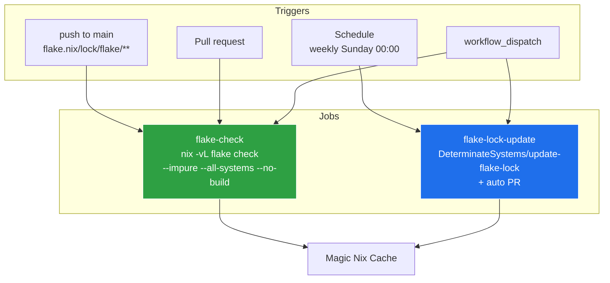

<div align="center">
    <h1>ai-nixCfg</h1>
    <strong>Nix home-manager modules and personal configurations for AI coding assistants, LLM tools, MCP integrations, voice input, and agent orchestration.</strong>
</div>

______________________________________________________________________

<div align="center">
    <a href="https://github.com/DivitMittal/ai-nixCfg/actions/workflows/flake-check.yml">
        
    </a>
    <a href="https://github.com/DivitMittal/ai-nixCfg/actions/workflows/flake-lock-update.yml">
        
    </a>
</div>

______________________________________________________________________

## Table of Contents

- [Overview](#overview)
- [Architecture](#architecture)
- [Quick Start](#quick-start)
- [As a Flake Input](#as-a-flake-input)
- [Using Reusable Modules](#using-reusable-modules)
- [Using Personal Configurations (`Cfg`)](#using-personal-configurations-cfg)
- [Tool Configurations](#tool-configurations)
- [Shared Content Library (`_common`)](#shared-content-library-_common)
  - [Commands](#commands)
  - [Skills](#skills)
  - [Agents](#agents)
  - [Rules](#rules)
- [MCP Servers](#mcp-servers)
- [Voice & Browser](#voice--browser)
- [Optimization & Orchestration](#optimization--orchestration)
- [Custom Packages](#custom-packages)
- [CI & Pre-commit](#ci--pre-commit)
- [Project Structure](#project-structure)
- [Conventions](#conventions)
- [Commands](#commands-1)
- [Related Repositories](#related-repositories)
- [For AI Agents](#for-ai-agents)

______________________________________________________________________

## Overview

This repository provides reusable Nix home-manager modules and personal configurations for a complete AI development toolkit — declarative, reproducible, and platform-aware (Linux + macOS). It includes agentic coding assistants, LLM CLIs, MCP integrations, voice input via Talon, terminal multiplexers for agents, token-compression proxies, and a curated set of custom packages.

### Tool Catalog

| Category | Tools |
|----------|-------|
| **Agentic coding assistants** | Claude Code, Codex, GitHub Copilot CLI, OpenCode, Crush, Antigravity CLI, Pi, Hermes Agent, OpenClaw (aarch64-darwin) |
| **Companion tools** | `ccs`, `ccusage`, `ccstatusline`, `gnhf` |
| **LLM CLI tools** | `aichat`, `fabric-ai` |
| **VCS tools** | `geminicommit`, `aicommit2`, `lumen` |
| **Workflow / SDD** | `ralph-tui`, `openspec`, `openspecui`, `n8n`, `bead` (bd), `Beads-Viewer` (bv), `mardi-gras` |
| **Orchestration** | `ruflo`, `caveman`, `gastown` (gt), `zeroshot` |
| **Multiplexers** | `kolu`, `herdr`, `gnhf` |
| **Browser automation** | `lightpanda`, `agent-browser`, `playwright-mcp` |
| **Cloud platforms** | `kaggle`, `huggingface_hub` (`hf`) |
| **Voice** | Talon + `talon-community`, Wispr Flow (darwin cask) |
| **Token optimization** | `headroom` proxy, `rtk` (Rust Token Killer), `ponytail` config |
| **Custom packages** | `gowa` (WhatsApp MCP), `zai` (Z.AI CLI), `lightpanda` |

______________________________________________________________________

## Architecture

```mermaid
graph TD
    subgraph "flake.nix"
        F[Flake Entry]
    end

    F --> FP[flake/<br/>flake-parts modules]
    F --> MOD[modules/<br/>home-manager modules]
    F --> CFG[config/<br/>personal configurations]
    F --> PKG[pkgs/<br/>custom packages]

    FP --> FApps[apps.nix<br/>#ai shell]
    FP --> FChecks[checks.nix<br/>prek hooks]
    FP --> FDev[devshells.nix<br/>nixd, alejandra, nvfetcher]
    FP --> FFmt[formatters.nix<br/>treefmt-nix]
    FP --> FSand[sandnix.nix<br/>sandboxed claude]
    FP --> FAct[actions/<br/>CI workflows]

    MOD --> Mccs[ccs.nix]
    MOD --> Mcodex[codex.nix]
    MOD --> Mcrush[crush.nix]
    MOD --> Mherdr[herdr.nix]
    MOD --> Mn8n[n8n.nix]
    MOD --> Mralph[ralph-tui.nix]
    MOD --> Mtalon[talon.nix]
    MOD --> Mghnf[ghnf.nix]

    CFG --> CHome[home/]
    CHome --> CSet[setup.nix]
    CHome --> CCoding[coding/]
    CHome --> CCli[cli/]
    CHome --> CCld[cloud.nix]
    CHome --> CMcp[mcp.nix]
    CHome --> CAsst[assistants/]
    CHome --> CVoic[voice.nix]
    CHome --> CBrws[browser.nix]
    CHome --> CGui[gui.nix]
    CHome --> CMult[multiplexers.nix]
    CHome --> COpt[optimization/]
    CHome --> COrc[orchestration.nix]
    CHome --> CRvw[review.nix]
    CHome --> CTsk[tasks.nix]
    CHome --> CUsg[usage.nix]
    CHome --> CWfl[workflows.nix]

    CCoding --> CCom[_common/<br/>commands, skills,<br/>agents, rules]
    CCoding --> CClaud[claude/]
    CCoding --> CCodx[codex/]
    CCoding --> CCopi[copilot-cli/]
    CCoding --> COpen[opencode/]
    CCoding --> CCrush[crush/]
    CCoding --> CAnti[antigravity-cli/]
    CCoding --> CPi[pi/]

    PKG --> PCust[custom/<br/>gowa, lightpanda, zai]
    PKG --> PDarw[darwin/<br/>Perplexity-bin]
    PKG --> PSrc[_sources/<br/>nvfetcher]

    style F fill:#1f6feb,stroke:#fff,color:#fff
    style CCoding fill:#2ea043,stroke:#fff,color:#fff
    style CCom fill:#bf8700,stroke:#fff,color:#fff
    style CHome fill:#6e40c9,stroke:#fff,color:#fff
    style PKG fill:#cf222e,stroke:#fff,color:#fff
```



The flake has four top-level trees, each auto-imported via `import-tree`:

| Tree | Purpose | Auto-import mechanism |
|------|---------|------------------------|
| `flake/` | flake-parts modules — apps, checks, devshells, formatters, CI | `inputs.import-tree ./flake` |
| `modules/` | Reusable home-manager modules exported via `flake.homeManagerModules.*` | `import-tree` in `modules/default.nix` |
| `config/` | Personal `Cfg` home configuration — one composable layer | `import-tree` + `homeManagerModules.default` |
| `pkgs/` | Custom packages re-exported via `packages.<system>` | Direct attribute set merge |

`config/home/coding/_common/` is a **pure-data library** — it holds shared commands/skills/agents/rules that each tool's `common.nix` generator renders into the tool's native format. Content edits happen once; metadata ripples to every tool.

______________________________________________________________________

## Quick Start

### Drop into a pre-built AI shell

```sh
nix run github:DivitMittal/ai-nixCfg#ai --impure
```

Spawns `$SHELL` with the full AI toolchain prepended to `PATH` — all agentic assistants, LLM CLIs, workflow tools, MCP binaries, and the headroom/rtk wrappers. Ephemeral: nothing is activated or written to your home directory.

`--impure` lets the app read `$USER`/`$HOME` from your environment so the configuration adapts to whoever runs it.

### Augment your current shell's `PATH`

```sh
nix shell github:DivitMittal/ai-nixCfg --impure
```

Same binaries, but you stay in your existing shell.

### Enter the dev shell

```sh
nix develop
```

Provides `nixd` (LSP), `alejandra` (formatter), `nvfetcher` (package source updater), and `apm-cli`. Includes a `pkgs-update` command that regenerates `pkgs/_sources/`.

______________________________________________________________________

## As a Flake Input

```nix
{
  inputs = {
    ai-nixCfg = {
      url = "github:DivitMittal/ai-nixCfg";
      inputs.nixpkgs.follows = "nixpkgs";
    };
  };
}
```

### Available Substituters

Pre-configured in `flake.nix` (`nixConfig.extra-substituters`):

| Substituter | Purpose |
|-------------|---------|
| `cache.numtide.com` | `llm-agents.nix` packages |
| `pi.cachix.org` | `pi.nix` packages |
| `nix-community.cachix.org` | `home-manager` and community packages |

### Supported Systems

Pulled from `nix-systems/default` — Linux (`x86_64`, `aarch64`) + macOS (`x86_64`, `aarch64`). Note: OpenClaw and Hermes Agent bundles are **aarch64-darwin only**; other tools work cross-platform.

______________________________________________________________________

## Using Reusable Modules

Import individual home-manager modules into your configuration:

```nix
{ inputs, ... }: {
  imports = [
    inputs.ai-nixCfg.homeManagerModules.ccs
    inputs.ai-nixCfg.homeManagerModules.codex
    inputs.ai-nixCfg.homeManagerModules.crush
    inputs.ai-nixCfg.homeManagerModules.herdr
    inputs.ai-nixCfg.homeManagerModules.n8n
    inputs.ai-nixCfg.homeManagerModules.ralph-tui
    inputs.ai-nixCfg.homeManagerModules.talon
    inputs.ai-nixCfg.homeManagerModules.ghnf
  ];
}
```

### Module Reference

| Module | What it configures |
|--------|--------------------|
| `default` | Imports every `modules/home/*.nix` — useful when consuming the full personal `Cfg` |
| `ccs` | Claude Code Switcher — package, XDG-aware config dir, `mutableUserSettings` deep-merge, legacy symlinks for OAuth tokens |
| `codex` | Skills & prompts management via `xdg.configFile` |
| `crush` | MCP servers, LSP, permissions, commands (typed submodules) |
| `herdr` | Terminal multiplexer for AI agents — panes, tabs, agent labels (alias `herdr`) |
| `n8n` | Workflow automation with SQLite backend, pnpm-dlx fallback on Darwin |
| `ralph-tui` | AI agent loop orchestrator TUI — high-contrast theme by default |
| `talon` | Talon voice programming — `~/.talon` user dir, talon-community clone |
| `ghnf` | (re-export from upstream) |

### Example: `ccs` Module

```nix
{
  programs.ccs = {
    enable = true;
    package = pkgs.writeShellScriptBin "ccs" ''
      exec ${pkgs.pnpm}/bin/pnpm dlx @kaitranntt/ccs "$@"
    '';
    mutableUserSettings = true;       # Deep-merge; preserves OAuth tokens
    useXdgConfigHome = true;          # CCS_DIR = $XDG_CONFIG_HOME/ccs
    settings.preferences.theme = "dark";
  };
}
```

______________________________________________________________________

## Using Personal Configurations (`Cfg`)

To import the full personal setup, use the `Cfg` module:

```nix
{ inputs, ... }: {
  imports = [inputs.ai-nixCfg.homeManagerModules.Cfg];
}
```

This composes `config/setup.nix`, which pulls in `import-tree ./home`, `homeManagerModules.default`, plus upstream modules:



Or import specific subsets by path:

```nix
{ inputs, ... }: {
  imports = [
    (inputs.ai-nixCfg + "/config/home/coding")        # Agentic assistants only
    (inputs.ai-nixCfg + "/config/home/cli")           # LLM CLI tools only
    (inputs.ai-nixCfg + "/config/home/cloud.nix")      # Cloud platform CLIs only
    (inputs.ai-nixCfg + "/config/home/mcp.nix")        # Shared MCP servers only
    (inputs.ai-nixCfg + "/config/home/optimization")   # headroom + rtk + ponytail
  ];
}
```

### What `Cfg` Includes

| Layer | Contents |
|-------|----------|
| **Coding assistants** | Claude Code, Codex, Copilot CLI, OpenCode, Crush, Antigravity CLI, Pi, plus commands/skills/agents/rules from `_common` |
| **Companion tools** | `ccs`, `ccusage`, `ccstatusline`, `gnhf` |
| **LLM CLI tools** | `aichat` (OpenRouter model zoo), `fabric-ai` |
| **VCS tools** | `geminicommit`, `aicommit2`, `lumen` |
| **Workflow / SDD** | `ralph-tui`, `openspec` + `openspecui`, `n8n`, `bead` (bd), `Beads-Viewer` (bv), `mardi-gras` |
| **Orchestration** | `ruflo`, `caveman`, `gastown` (gt), `zeroshot` |
| **Multiplexers** | `kolu`, `herdr`, `gnhf` |
| **Browser** | `lightpanda`, `agent-browser`, `playwright-mcp` |
| **Cloud** | `kaggle`, `hf` (huggingface_hub CLI) |
| **Retrieval** | `ck`, `codegraph`, `dolt` |
| **Misc CLI** | `happy-coder`, `zai`, `mmx-cli` |
| **Voice (Darwin)** | Talon + talon-community, Wispr Flow cask (gated by `aiNixCfg.voice.enable`) |
| **MCP servers** | `gowa`, `deepwiki`, `octocode`, `exa`, `playwright` |
| **Sandboxed app** | `claude-sandboxed` via `sandnix` (macOS: sandbox-exec, Linux: landrun) |

### Top-level Options

```nix
{
  aiNixCfg = {
    guiApps.enable = false;   # Disable GUI app casks (Antigravity, Perplexity, …)
    voice.enable = false;     # Skip Talon + Wispr Flow installation
  };
}
```

The standalone `nix run ...#ai` app sets both to `false` so it stays lean and needs no `brew-nix` overlay.

______________________________________________________________________

## Tool Configurations

Each tool under `config/home/coding/<tool>/` follows the same shape:

| File | Purpose |
|------|---------|
| `setup.nix` | Package installation + `programs.<tool>.enable` |
| `settings.nix` | Provider config, model defaults, TUI tweaks |
| `mcp.nix` | Tool-specific MCP server overrides |
| `permissions.nix` | (Claude/Crush) Allow/deny tool lists |
| `hooks.nix` | (Claude) Pre/Post-tool-use hooks |
| `tui.nix` | (Claude) Status line + theme |
| `plugins.nix` | (Claude) Plugin enablement |
| `common.nix` | Renders shared `_common/` library into the tool's native format |
| `providers.nix` | (OpenCode) Provider/model definitions |
| `lsp.nix`, `formatters.nix`, `themes/` | (OpenCode) LSP, formatter, theme bundles |

### Tool Configuration Matrix

| Tool | Settings | MCP | Permissions | Hooks | Plugins | TUI | Common Generator |
|------|----------|-----|-------------|-------|---------|-----|------------------|
| Claude Code | ✓ | ✓ | ✓ | ✓ (PreToolUse security, PostToolUse `nix fmt`) | ✓ (caveman) | ✓ (ccstatusline) | commands + skills + agents + rules |
| Codex | ✓ profiles (default/conservative/power) | ✓ | – | – | – | ✓ (animations) | prompts + skills |
| Copilot CLI | ✓ | ✓ | ✓ | – | – | ✓ (theme) | skills + agents |
| OpenCode | ✓ providers (Antigravity + Codex Everywhere + Google) | ✓ | – | – | ✓ (`antigravity-auth`, `beads`, `pty`) | – | context (memory + rules) |
| Crush | ✓ | ✓ | ✓ | – | – | – | commands |
| Antigravity CLI | ✓ | ✓ | – | – | – | – | commands |
| Pi | ✓ | – | – | – | 14 extensions (bash-blacklist, codex-fast, fetch, lsp, plan-mode, …) | – | rules + skills + prompt templates |

### Claude Code Hooks

| Phase | Matcher | Action |
|-------|---------|--------|
| `PreToolUse` | `Bash` | Block `rm -rf` against dangerous paths; block `.env` access |
| `PreToolUse` | `Read\|Edit\|Write` | Block access to `.env` files (allow `.env.sample`) |
| `PostToolUse` | `Edit\|Write` | Auto-format `*.nix` files via `nix fmt` |

### Codex Profiles

| Profile | Model | Approval | Sandbox | Notes |
|---------|-------|----------|---------|-------|
| `default` | `gpt-5.2-codex` | `on-request` | `workspace-write` | Standard daily use |
| `conservative` | `gpt-5.2-codex` | `untrusted` | `read-only` | Audit / review |
| `power` | `gpt-5.2-codex` (xhigh reasoning) | `on-failure` | `workspace-write` + network | Unattended autonomy |

### Pi Coding-Agent Extensions

| Extension | Purpose |
|-----------|---------|
| `fetch` | URL → markdown extraction (Mozilla Readability, jsdom, turndown, unpdf) |
| `bash-blacklist` | Block dangerous shell commands |
| `codex-fast.ts` | Optimized Codex prompt construction |
| `continue-turn` | Continue a paused turn after manual edit |
| `explorer-mode` | Read-only exploration mode |
| `ext-dev.ts` | Extension authoring toolkit |
| `git-diff` | Git diff integration |
| `lsp` | LSP-aware completions/refactors |
| `plan-mode` | Plan-then-execute workflow |
| `post-edit` | Post-edit hooks |
| `question.ts` | Structured user Q&A |
| `reload-shortcut` | Hot-reload extensions |
| `systemprompt.ts` | System prompt customization |
| `tmux-mirror` | tmux buffer mirroring |
| `tps-tracker.ts` | Tokens-per-second tracker |
| `web-search` | Web search fallback |

Pinned to upstream `kissgyorgy/coding-agents` rev `4d8c448033ca332b55e79de4cbd0737da5c5cfda`. Update by bumping rev + re-running `nix build` to refresh hashes.

### OpenCode Providers

| Provider | Models |
|----------|--------|
| `codex-everywhere` | GPT-5.5 |
| `google` | Gemini 3 Pro (Antigravity), Gemini 3 Flash, Gemini 2.5 Pro/Flash, Gemini 3 Flash/Pro Preview, Claude Sonnet 4.5/4.6 + Thinking, Claude Opus 4.5/4.6 + Thinking |
| `opencode` (default) | Standard OpenCode model zoo |

The Antigravity provider exposes Claude and Gemini models via the Antigravity backend (no separate Google Cloud project required).

______________________________________________________________________

## Shared Content Library (`_common`)

`config/home/coding/_common/` holds shared commands, skills, agents, and rules as pure data. Each tool's `common.nix` consumes this library and renders content into the tool's native format (YAML frontmatter for Claude/Crush/Copilot, prompts for Codex, skill files for Pi, etc.).



Edits to a common markdown file propagate to every tool automatically on the next `home-manager switch`.

### Commands

Reusable slash commands. Body is tool-agnostic; metadata in `_common/commands/default.nix` adds per-tool fields (`allowed-tools` for Claude/Crush, `tools` for Copilot, `argument-hint` for Codex).

| Command | Description | Argument hint |
|---------|-------------|---------------|
| `build` | Build the project | – |
| `changelog` | Update `CHANGELOG.md` | `[version]` |
| `clean` | Clean build artifacts and caches | – |
| `commit` | Create atomic Conventional Commits (`type(scope): description`) | `[message-hint]` |
| `doc` | Generate or improve documentation | `<file-or-symbol>` |
| `explain` | Explain code in detail | `<file-or-symbol>` |
| `fix-issue` | Fix a GitHub issue end-to-end | `<issue-number>` |
| `human-code-refactor` | Refactor to remove AI/LLM telltale patterns | `<file-or-symbol>` |
| `pr` | Create a pull request with description | `[title]` |
| `refactor` | Refactor while preserving behavior | `<file-or-symbol>` |
| `review` | Review code for issues | `[file-or-path]` |
| `test` | Run project tests | – |

### Skills

Tool-agnostic deep-knowledge documents. Loaded on-demand by the agent.

| Skill | Description | Domain |
|-------|-------------|--------|
| `nix-flakes` | Deep knowledge of Nix flakes — `flake.nix`, inputs, outputs, `follows`, `flake-parts` | `nix/flakes` |
| `home-manager-modules` | Home Manager module patterns — typed options, `mkIf`, `cfg.enable` gating | `nix/home-manager` |
| `conventional-commits` | Conventional Commits format — `type(scope): description` | `git/commits` |

### Agents

Predefined subagent personas, rendered with tool-appropriate metadata.

| Agent | Model | Tools | When to use |
|-------|-------|-------|-------------|
| `code-reviewer` | Sonnet | Read, Grep, Glob | Proactively for code reviews and PR analysis |
| `nix-expert` | Sonnet | Read, Write, Edit, Grep, Glob, Bash | MUST BE USED for Nix/NixOS configuration, flakes, and derivations |
| `security-auditor` | Opus | Read, Grep, Glob | MUST BE USED for security reviews and vulnerability assessment |
| `test-writer` | Sonnet | Read, Write, Edit, Grep, Bash | When writing or improving tests |

### Rules

Always-on instructions loaded into every agent's system prompt via `context = memoryInstruction + "\n\n" + combinedRules`.

| Rule | Covers |
|------|--------|
| `git-workflow` | Conventional Commits format, atomic commits, `nix fmt` before commit, `nix flake check` for Nix projects |
| `security` | No committed secrets (use agenix/ragenix), parameterized queries, allowlists over denylists, `.env` ignored |
| `documentation` | Comments explain "why", docs kept current, README sections for purpose/install/usage/config |
| `code-quality` | Pure functions over side effects, small focused functions, max 3-4 nesting, explicit error handling |

______________________________________________________________________

## MCP Servers

Defined in `config/home/mcp.nix` and applied via `programs.mcp.servers`. Toggleable per-tool via each `coding/<tool>/mcp.nix`.

| Server | Type | Source | Purpose |
|--------|------|--------|---------|
| `deepwiki` | HTTP | `https://mcp.deepwiki.com/mcp` | AI-powered repo documentation |
| `octocode` | stdio | `pnpm dlx octocode-mcp@latest` | Code research agent (local + GitHub + npm) |
| `exa` | stdio | `pnpm dlx exa-mcp-server` | Neural web search |
| `playwright` | stdio | `pnpm dlx @playwright/mcp` | Browser automation |
| `gowa` | package | `customPkgs.gowa` | WhatsApp REST API + MCP (Go) |

> **Optional servers** (commented in `mcp.nix`): `headroom`, `cognee` (knowledge graph memory), `sequential-thinking`, `filesystem`, `memory`, `markitdown`. Uncomment to enable.

### Per-Tool MCP Configuration

| Tool | MCP file | Notes |
|------|----------|-------|
| Claude Code | `claude/mcp.nix` | `enableMcpIntegration = true`, `enableAllProjectMcpServers = true` |
| Codex | `codex/mcp.nix` | Inherits global servers |
| Copilot CLI | `copilot-cli/mcp.nix` | Per-server MCP entries |
| Crush | `crush/mcp.nix` | Native MCP |
| OpenCode | `opencode/mcp.nix` | Native MCP via `mcp` block |
| Antigravity CLI | `antigravity-cli/mcp.nix` | Native MCP |

______________________________________________________________________

## Voice & Browser

### Voice (`config/home/voice.nix`)

Voice input via Talon — declarative, cross-platform (Linux + Darwin), with optional macOS app installation.



| Option | Default | Purpose |
|--------|---------|---------|
| `aiNixCfg.voice.enable` | `true` | Master switch |
| `aiNixCfg.voice.installDarwinApps` | `pkgs.stdenv.isDarwin` | Install Wispr Flow via Homebrew cask |
| `aiNixCfg.voice.installTalonDarwinApp` | `false` | Install Talon.app via cask |
| `aiNixCfg.voice.enableTalonCommunity` | `false` | Clone `talonhub/community` into `~/.talon/user/` |

`programs.talon.files."custom/ai-nixCfg.talon"` carries a personal `.talon` script in `voice/talon/`.

### Browser (`config/home/browser.nix`)

| Tool | Source | Purpose |
|------|--------|---------|
| `lightpanda` | `customPkgs.lightpanda` | Headless browser built for AI (Rust) |
| `agent-browser` | nixpkgs on Linux; `pnpm dlx` on Darwin | Headless browser automation CLI |
| `playwright-mcp` | `pnpm dlx @playwright/mcp` | Playwright-driven MCP server |

`LIGHTPANDA_DISABLE_TELEMETRY=false` is set as a session variable.

______________________________________________________________________

## Optimization & Orchestration

### Token Optimization (`config/home/optimization/`)



| File | Component | Role |
|------|-----------|------|
| `optimization/headroom.nix` | `headroom` proxy + shell aliases | Per-agent proxy with `token` mode + `rtk` context tool |
| `optimization/rtk.nix` | `rtk` CLI | Rust Token Killer — compresses command output 60–90% |
| `optimization/ponytail.nix` | `~/.config/ponytail/config.json` | Lazy senior-dev plugin — enforces decision ladder |

#### Headroom Shell Aliases

```sh
hr-claude    # headroom wrap claude
hr-codex     # headroom wrap codex
hr-opencode  # headroom wrap opencode
hr-copilot   # headroom wrap copilot
hr-openclaw  # headroom wrap openclaw
hr-proxy     # run proxy standalone on :8787
hr-learn     # headroom learn --apply
hr-stats     # headroom perf
hr-check     # headroom doctor
```

#### Headroom Environment Defaults

| Variable | Default | Notes |
|----------|---------|-------|
| `HEADROOM_PORT` | `8787` | Proxy listen port |
| `HEADROOM_HOST` | `127.0.0.1` | Bind address |
| `HEADROOM_MODE` | `token` | Compression mode |
| `HEADROOM_TELEMETRY` | `off` | No telemetry |
| `HEADROOM_OUTPUT_SHAPER` | `1` | Enabled |
| `HEADROOM_CONTEXT_TOOL` | `rtk` | Use rtk for context |
| `HEADROOM_UPDATE_CHECK` | `off` | No update checks |

### Multiplexers (`config/home/multiplexers.nix`)

| Tool | Source | Purpose |
|------|--------|---------|
| `herdr` | `programs.herdr` (terminal multiplexer) | Pane/tab/workspace orchestration for agents; `ctrl+a` prefix |
| `kolu` | `services.kolu` (Juspay kolu) | Agent sandboxing / coordination |

Herdr keybindings:

| Action | Binding |
|--------|---------|
| Previous/next tab | `alt+left` / `alt+right` |
| Previous/next workspace | `alt+up` / `alt+down` |
| Switch workspace | `prefix+shift+1..9` |
| Focus pane | `ctrl+arrows` |
| Cycle panes | `ctrl+tab` / `ctrl+shift+tab` |
| Focus agent | `alt+1..9` |

### Orchestration (`config/home/orchestration.nix`)

| Tool | Install | Purpose |
|------|---------|---------|
| `ruflo` | `pnpm dlx ruflo` | Agent meta-harness for Claude Code & Codex (`ruflo init` / `ruflo mcp start`) |
| `caveman` | `pnpm dlx github:JuliusBrussee/caveman` | Token-compression skill/plugin installer |
| `gastown` | `customPkgs.gastown` (binary `gt`) | Gas Town multi-agent workspace manager |
| `zeroshot` | `pnpm dlx @the-open-engine/zeroshot` | Zero-shot orchestration |
| `mardi-gras` | `customPkgs.mardi-gras` (binary `mg`) | Beads issue-tracker TUI, parade-style |
| `ralph-tui` | `programs.ralph-tui` | AI Agent Loop Orchestrator TUI (high-contrast theme) |
| `gnhf` | `programs.gnhf` | Conventional-Commits-preset auto-commit helper |
| `openspec` | `uvx @fission-ai/openspec@latest` | Spec-driven development CLI |
| `openspecui` | `customPkgs.openspecui` | Spec browser UI |

### Tasks (`config/home/tasks.nix`)

| Tool | Purpose |
|------|---------|
| `bead` (`bd`) | Memory system / issue tracker |
| `Beads-Viewer` (`bv`) | Beads graph-aware TUI |

### Review (`config/home/review.nix`)

| Tool | Purpose |
|------|---------|
| `lumen` | AI-assisted git review, diff, and commit helper |

### Proxy (`config/home/proxy.nix`)

Currently empty placeholder for shared proxy configuration.

### Usage (`config/home/usage.nix`)

Currently exposes `ccusage` for Claude Code usage tracking via `ai-nixCfg.inputs.ccusage`.

______________________________________________________________________

## Custom Packages

Defined under `pkgs/` and re-exported via `packages.<system>`:



### `pkgs/custom/`

| Package | Description | Source |
|---------|-------------|--------|
| `gowa` | WhatsApp REST API with MCP support (Go) | `pkgs/custom/gowa/package.nix` (nvfetcher) |
| `lightpanda` | Headless browser built for AI automation (Rust) | `pkgs/custom/lightpanda/package.nix` (nvfetcher) |
| `zai` | Z.AI CLI for GLM models | `pkgs/custom/zai/package.nix` (nvfetcher) |

### `pkgs/darwin/`

| Package | Description | Source |
|---------|-------------|--------|
| `Perplexity-bin` | Perplexity desktop app | `pkgs/darwin/Perplexity-bin/package.nix` |

### Re-exported from `llm-agents.nix`

| Package | Purpose |
|---------|---------|
| `apm` | AI Package Manager (CLI) |
| `beads` (`bd`) | Memory system / issue tracker |
| `beads-viewer` (`bv`) | Beads graph-aware TUI |
| `mardi-gras` (`mg`) | Beads parade-style TUI |
| `ck` | Local-first semantic + hybrid BM25 search |
| `codegraph` | Semantic code intelligence for AI agents |
| `crush` | Charmbracelet Crush coding assistant |
| `dolt` | Git-style relational database |
| `gastown` (`gt`) | Gas Town multi-agent workspace manager |
| `happy-coder` | Mobile/web client for Codex & Claude Code (`happy`, `happy-mcp`) |
| `openspecui` | OpenSpec browser UI |
| `rtk` | Rust Token Killer — CLI output compressor |
| `claude-code` | Claude Code CLI |
| `ccstatusline` | Claude Code status line |
| `ccusage` | Claude Code usage tracker |
| `hermes-agent` | Hermes Agent (Python) |
| `openclaw`, `summarize`, `gogcli` | (aarch64-darwin only) |

### Updating Sources

```sh
nix develop
pkgs-update   # regenerates pkgs/_sources/
```

Never edit `pkgs/_sources/` by hand — it's regenerated by `nvfetcher`.

### Using Custom Packages

```nix
{ inputs, pkgs, ... }: {
  home.packages = [
    inputs.ai-nixCfg.packages.${pkgs.system}.gowa
    inputs.ai-nixCfg.packages.${pkgs.system}.lightpanda
    inputs.ai-nixCfg.packages.${pkgs.system}.zai
  ];
}
```

______________________________________________________________________

## CI & Pre-commit

### CI Workflows

Generated via `nix run .#render-workflows` — do **not** hand-edit `.github/workflows/*.yml`.



| Workflow | Triggers | Job |
|----------|----------|-----|
| `flake-check.yml` | push, pull_request, manual | `nix -vL flake check --impure --all-systems --no-build` |
| `flake-lock-update.yml` | weekly cron (`0 0 * * 0`), manual | `DeterminateSystems/update-flake-lock@main` (opens PR) |

Pre-commit hooks (`.pre-commit-config.yaml`) also run in CI via `actions-nix`.

### Pre-commit Hooks

Configured via `git-hooks` flake module in `flake/checks.nix`:

| Hook | Purpose |
|------|---------|
| `treefmt` | Nix formatting (disabled — handled by `nix fmt`) |
| `trim-trailing-whitespace` | Strip trailing whitespace |
| `mixed-line-endings` | Enforce LF endings (disabled by default) |
| `mdformat` | Markdown formatting (excludes `.apm/`) |
| `check-added-large-files` | Block large binary additions (images excluded) |
| `check-case-conflicts` | Filesystem case-collision guard |
| `check-executables-have-shebangs` | All executables start with `#!` |
| `check-shebang-scripts-are-executable` | All scripts with shebangs are executable |
| `fix-byte-order-marker` | Strip UTF-8 BOM |
| `check-merge-conflicts` | Block unresolved merge-conflict markers |
| `detect-private-keys` | Block committed SSH / PGP keys |

### Formatters (`flake/formatters.nix`)

| Formatter | Purpose |
|-----------|---------|
| `alejandra` | Nix formatter |
| `deadnix` | Remove unused Nix bindings |
| `statix` | Nix linter |

Run `nix fmt` to format all Nix files. `.github/*` is excluded (generated).

______________________________________________________________________

## Project Structure

```
.
├── flake.nix                   # Main flake entry point
├── flake/                      # flake-parts module definitions
│   ├── apps.nix                # #ai shell app (PATH-augmented interactive shell)
│   ├── checks.nix              # Prek/pre-commit hooks
│   ├── devshells.nix           # Dev shell (nixd, alejandra, nvfetcher, apm-cli)
│   ├── formatters.nix          # Code formatters (treefmt-nix)
│   ├── sandnix.nix             # Sandboxed claude-code wrapper
│   ├── AGENTS.md               # Flake-level agent context
│   └── actions/                # GitHub Actions workflow definitions
│       ├── common.nix          # Shared workflow fragments
│       ├── flake-check.nix     # flake-check.yml
│       └── flake-lock-update.nix # flake-lock-update.yml
│
├── modules/                    # Home-manager modules (reusable)
│   ├── default.nix             # Exports: ccs, codex, crush, herdr, n8n, ralph-tui, talon, ghnf
│   └── home/
│       ├── ccs.nix             # Claude Code Switcher
│       ├── codex.nix           # Skills + prompts
│       ├── crush.nix           # MCP/LSP/permissions/commands
│       ├── ghnf.nix            # gnhf auto-committer
│       ├── herdr.nix           # Terminal multiplexer for agents
│       ├── n8n.nix             # n8n workflow automation
│       ├── ralph-tui.nix       # Agent loop orchestrator TUI
│       └── talon.nix           # Talon voice programming
│
├── config/                     # Personal home-manager configuration
│   ├── default.nix             # Exports: Cfg, default
│   ├── setup.nix               # Composes config/home/ + upstream modules
│   └── home/
│       ├── coding/             # Agentic coding assistants
│       │   ├── _common/        # Pure data library
│       │   │   ├── commands/   # 12 reusable commands
│       │   │   ├── skills/     # 3 skills
│       │   │   ├── agents/     # 4 agents
│       │   │   ├── rules/      # 4 rules
│       │   │   ├── lib.nix     # Shared helpers (mkYamlFrontmatter, memoryInstruction)
│       │   │   └── default.nix # Library entry point
│       │   ├── claude/         # Claude Code setup, hooks, TUI, permissions, plugins
│       │   ├── codex/          # Codex profiles, settings, prompts, skills
│       │   ├── copilot-cli/    # Copilot CLI settings, permissions, skills, agents
│       │   ├── opencode/       # Providers, themes, formatters, LSP, plugins
│       │   ├── crush/          # Crush settings, MCP, LSP, permissions
│       │   ├── antigravity-cli/# Antigravity CLI settings + global skills
│       │   ├── pi/             # Pi coding agent + 14 extensions
│       │   └── misc.nix        # Misc CLI tools (happy-coder, zai, mmx-cli)
│       ├── assistants/         # Standalone assistants
│       │   ├── hermes-agent/   # Hermes Agent setup
│       │   └── openclaw/       # OpenClaw setup (aarch64-darwin)
│       ├── cli/                # LLM CLI tools
│       │   ├── aichat.nix      # Multi-provider LLM client (OpenRouter zoo)
│       │   ├── fabric.nix      # Pattern-based AI workflows
│       │   ├── vcs.nix         # geminicommit, aicommit2
│       │   └── retrival.nix    # ck, codegraph, dolt
│       ├── optimization/       # Token optimization stack
│       │   ├── headroom.nix    # headroom proxy + shell aliases
│       │   ├── rtk.nix         # rtk CLI wrapper
│       │   └── ponytail.nix    # Ponytail plugin config
│       ├── multiplexers.nix    # herdr + kolu
│       ├── orchestration.nix   # ruflo, caveman, gastown, zeroshot, mardi-gras
│       ├── tasks.nix           # bead (bd), Beads-Viewer (bv)
│       ├── review.nix          # lumen
│       ├── proxy.nix           # Shared proxy config
│       ├── usage.nix           # ccusage
│       ├── workflows.nix       # ralph-tui, gnhf, openspec, openspecui, …
│       ├── cloud.nix           # kaggle, hf
│       ├── mcp.nix             # Shared MCP servers (deepwiki, octocode, exa, gowa)
│       ├── browser.nix         # lightpanda, agent-browser, playwright-mcp
│       ├── gui.nix             # GUI casks (Antigravity, Perplexity, t3-code, handy)
│       └── voice.nix           # Talon + Wispr Flow (Darwin)
│
├── pkgs/                       # Custom package definitions
│   ├── default.nix             # Re-exports all packages per system
│   ├── custom/
│   │   ├── default.nix
│   │   ├── gowa/               # WhatsApp REST API + MCP (Go)
│   │   ├── lightpanda/         # Headless browser (Rust)
│   │   └── zai/                # Z.AI CLI
│   ├── darwin/
│   │   ├── default.nix
│   │   └── Perplexity-bin/     # Perplexity desktop app
│   ├── _sources/               # Generated by nvfetcher — never edit manually
│   └── nvfetcher.toml          # nvfetcher source definitions
│
├── .github/workflows/          # Auto-generated — render via `nix run .#render-workflows`
├── .claude/                    # Claude Code project config (rules, agents, skills)
├── apm.yml                     # AI Package Manager config (serena, nixos MCP)
├── apm.lock.yaml
├── .envrc                      # nix-direnv auto-activation
├── .pre-commit-config.yaml     # Symlink to git-hooks-managed config
├── .editorconfig               # UTF-8, LF, 2-space indent
└── AGENTS.md                   # AI agent instructions (project context)
```

______________________________________________________________________

## Conventions

### Nix Style

| Rule | Pattern |
|------|---------|
| **Module header** | `{ config, lib, pkgs, ... }: let inherit (lib) mkIf mkOption types; cfg = config.programs.<name>; in { options = {...}; config = mkIf cfg.enable {...}; }` |
| **Option types** | `lib.types.*` with `description`; `literalExpression` for examples; submodules for nested records |
| **Conditionals** | `mkIf`, `mkMerge`, `optionalAttrs`, `filterAttrs` — no `with` |
| **Naming** | kebab-case options and attrs; concise locals (`cfg`) |
| **Paths** | `xdg.configFile` for XDG paths; `home.file` for dotfiles; `pkgs.formats.json {}` / `pkgs.formats.yaml {}` for generated config |
| **Auto-import** | `customLib.scanPaths` from `OS-nixCfg` for `flake/`, `modules/home/`, `flake/actions/` |
| **Formatting** | `nix fmt` runs `alejandra` + `deadnix` + `statix` |
| **EditorConfig** | UTF-8, LF, 2-space indent, trim trailing whitespace |

### Anti-Patterns

- **Do not hand-edit** `.github/workflows/*.yml` — regenerate via `nix run .#render-workflows`
- **Do not commit secrets** — use agenix/ragenix; `.env` must stay in `.gitignore`
- **Do not force-push to `main`** — Conventional Commits required
- **Do not duplicate** command text in tool-specific dirs — modify common markdown instead
- **Do not bypass** `cfg.enable` guards
- **Avoid deep nesting** — prefer early returns and explicit error handling
- **No broad reads** of reference files in tool generators — load only what's needed

### Commits

Conventional Commits format: `type(scope): description`. Examples:

```text
feat(pi): add fetch extension with npm deps
fix(voice): guard missing brewCasks.wispr-flow
chore(pkgs): bump lightpanda source via nvfetcher
docs(readme): convert to tables + mermaid
refactor(coding): move assistants out of coding/
```

Run `nix fmt` and `nix flake check` before committing.

______________________________________________________________________

## Commands

### Common

```bash
nix fmt                                        # Format all Nix files (alejandra + deadnix + statix)
nix -vL flake check --impure --all-systems --no-build  # Validate flake
nix build .#<attr>                             # Build a package (e.g. .#gowa, .#zai)
nix develop                                    # Enter dev shell
```

### Project-specific

```bash
nix run .#render-workflows                     # Regenerate .github/workflows/*.yml
nix run .#pre-commit                           # Run pre-commit hooks
pkgs-update                                    # (in devshell) Refresh pkgs/_sources/
nix run github:DivitMittal/ai-nixCfg#ai --impure  # Drop into ephemeral AI shell
nix shell github:DivitMittal/ai-nixCfg --impure   # Augment current shell's PATH
```

### Build outputs

```bash
nix build .#gowa                               # WhatsApp MCP server
nix build .#lightpanda                         # Headless browser
nix build .#zai                                # Z.AI CLI
nix build .#Perplexity-bin                     # Perplexity desktop (darwin only)
```

______________________________________________________________________

## Related Repositories

- [DivitMittal/OS-nixCfg](https://github.com/DivitMittal/OS-nixCfg) — Main Nix configurations repository (provides `customLib.scanPaths`, `customLib.mkPnpmDlxBin`, `customLib.mkUvxBin`)

______________________________________________________________________

## For AI Agents

Context files (`AGENTS.md`, `.claude/rules/*.md`) are checked in but `.claude/agents/`, `.codex/`, `.opencode/` per-project state is generated — run `apm compile` before exploring the repo to get directory-level guidance.

The shared content library at `config/home/coding/_common/` is the canonical source for commands/skills/agents/rules — do **not** duplicate content in tool-specific directories; modify the common markdown and let the tool generators re-render.
